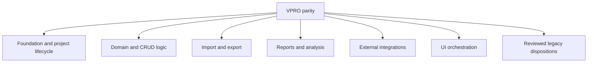

# Map and implement VPRO package parity

## Objective

Build `vpro` into a conventional, testable R package whose non-UI API can reproduce the supported behavior of the original Microsoft Access VPRO application. Preserve SQLite files as canonical persistent stores and retain an in-memory DuckDB composition layer for cross-database queries. Treat the exported Access objects as the primary behavioral source, and use the original application on the Windows VM as a controlled oracle when static exports are ambiguous.

This is a program of work rather than a single code change. Work will proceed through audited vertical slices, with a durable parity ledger preventing features from being lost across context windows. The Shiny UI is explicitly out of implementation scope for this effort, although its existing code will be inventoried as possible parity evidence and future API consumer.

## Confirmed decisions

- Inventory every legacy feature. Assign a reviewed disposition of migrate, modernize, retain externally, defer, or retire; do not silently omit obsolete features.
- Use the Windows VM and a disposable copy of the Access database to produce golden fixtures and investigate runtime behavior.
- In production R code, cite the original VBA module/procedure and briefly explain translation choices. Do not embed whole VBA routines.
- Keep SQLite as canonical storage and DuckDB as the in-memory query/composition layer.
- Regard `/home/bruno/Work/Active project/VPRO_ACCESS/VPro64_forAI` as the canonical SaveAsText corpus. The filesystem is case-sensitive; the actual directory uses `VPro64_forAI`.
- Do not treat `_TO_CLASSIFY`, generated form UIs, old DuckDB schemas, historical completion reports, or the current tests as authoritative without reconciliation against Access sources and the active package.

## Evidence hierarchy

When sources disagree, use this order:

1. Reproducible behavior observed in a disposable copy of the original Access application.
2. Raw SaveAsText modules, form/report code-behind, query SQL, macros, table definitions, relationships, and design metadata.
3. Original Access table data and metadata extracted through `mdbr`.
4. Current canonical SQLite schemas/data and `data-raw` conversion scripts.
5. Current package code under `R/` and active application under `inst/app/`.
6. Existing tests and generated specifications.
7. Historical/generated artifacts in `_TO_CLASSIFY` and prose completion claims.

Every mapping and test oracle must record its evidence source. Similar names alone do not establish parity.

## Deliverables

1. A deterministic source and target inventory with stable identifiers, hashes, source line ranges, parse confidence, and review state.
2. A machine-readable parity ledger covering Access objects, procedures, events, macros, SQL dependencies, forms, reports, integrations, R targets, and tests.
3. Generated Mermaid discrepancy trees, with an overview and domain-specific trees when the graph is too large.
4. A reviewed feature-disposition register.
5. A clean package foundation: metadata, installation/bootstrap, configuration, storage paths, connection lifecycle, project context, errors, exports, and a reliable baseline test suite.
6. Small, composable non-UI APIs implementing each supported VPRO behavior family.
7. Access-derived fixtures and equivalence tests, plus invariant, unit, integration, report, and import/export tests.
8. Roxygen2 documentation, package reference organization, NEWS entries for user-facing functionality, and passing package checks.
9. Updated project memory recording architecture decisions, parity status, unresolved questions, and the next implementation slice after each milestone.

## Phase 1 — Establish a trustworthy package baseline

Before porting domain behavior:

1. Record the current `git status` and avoid overwriting unrelated user changes. The repository currently has one local commit ahead of its remote and an untracked `AGENTS.md`; do not alter or discard either accidentally.
2. Repair package metadata and dependency declarations. Validate the malformed `Imports` entry, add test/build dependencies under appropriate fields, normalize package naming/casing, and ensure generated namespace/documentation files agree with exported functions.
3. Replace package-attach side effects with explicit APIs. Loading the package must not modify the installed `bslib` package or automatically launch Shiny. Provide explicit app-launch and optional theme APIs instead.
4. Implement deterministic first-run bootstrap:
   - copy bundled databases from `inst/data` to `rappdirs::user_data_dir("vpro")`;
   - create the YAML configuration from `inst/config.init.yml` in `rappdirs::user_config_dir("vpro")`;
   - never overwrite user files unless explicitly requested;
   - support temporary roots for tests;
   - migrate config versions explicitly.
5. Split `R/00.db.R`, `R/01.state.R`, and `R/zzz.R` by responsibility. Remove Shiny concerns from database functions and global package initialization.
6. Define typed conditions and consistent connection ownership. Ensure all connections are closed, DuckDB extensions are handled predictably, identifiers/literals are quoted safely, and writes use explicit transactions.
7. Repair or quarantine stale tests that source nonexistent paths. Create a minimal package-native test harness using temporary SQLite fixtures and no mandatory PostgreSQL, Docker, network, or Shiny startup.
8. Run formatting, documentation, targeted tests, full tests, and package check. Record any platform-specific skips explicitly.

Acceptance gate: the package loads without launching an app or mutating another package; a clean temporary user root bootstraps successfully; the canonical local databases can be composed through DuckDB; baseline tests and package metadata checks pass.

## Phase 2 — Build the inventory and parity system

Create version-controlled developer tooling under `data-raw/parity/`, not `_TO_CLASSIFY`. Keep the external SaveAsText corpus outside the built package.

### Inventory model

Generate normalized tables for:

- `objects`: Access forms, reports, modules/classes, queries, macros, tables and relationships; R functions, Shiny modules, SQL views, Quarto templates, and tests.
- `procedures`: VBA/R symbol, owner, kind, scope, signature, source range, body hash, event status, empty/no-op status, and complexity flags.
- `events`: form/report control, Access event property, handler or macro binding, resolution state, and target observer/API.
- `calls`: caller, call text, receiver, arguments, call kind, resolved target, confidence, and evidence range.
- `dependencies`: read/write/DDL, record/row/control source, form/report/macro invocation, subform linkage, filesystem, registry, COM, and external-process dependencies.
- `classifications`: domain, behavior, migration disposition, risk, automation confidence, and platform coupling. Allow multiple tags rather than one forced category.
- `parity`: one row per source requirement, approved target, status, evidence, linked test, reviewer, and waiver reason.
- `tests`: test type, target, parity requirement, fixture, oracle, execution requirements, result, and evidence hash.

Required parity statuses are `unmapped`, `candidate`, `implemented_unverified`, `verified_equivalent`, `verified_intentional_difference`, `deferred`, `retired_approved`, `blocked`, and `not_applicable`. Only reviewed verified/approved states count as complete.

### Parser and review workflow

1. Create a source manifest with relative paths, object family, encoding, byte size, and SHA-256.
2. Reuse concepts from `_TO_CLASSIFY/Tools/access_form_impl_spec.R`, but create maintained parsers with tests for:
   - UTF-16 and mixed encodings;
   - nested SaveAsText blocks and opaque binary/property blocks;
   - `CodeBehindForm` and report code;
   - `Sub`, `Function`, and `Property Get/Let/Set` procedures;
   - empty event handlers;
   - line continuations, named arguments, bare and qualified VBA calls;
   - macro `RunCode` actions;
   - saved query SQL and dynamically assembled SQL;
   - form/report sources, control expressions, subform links, grouping/sorting;
   - tables, indexes, defaults, relationship enforcement, cascade behavior, and join direction.
3. Parse target R code using R parse data, and inventory package functions, Shiny observers/modules, SQL strings/files, QMD templates, tests, and unresolved `source()` paths.
4. Resolve calls and object aliases in deterministic passes. Mark heuristics as candidates rather than verified matches.
5. Store manual aliases, mappings, dispositions, and review decisions in committed override files. Never hand-edit generated inventory tables.
6. Flag dynamic SQL, error suppression, registry/COM/API interaction, filesystem effects, ambiguous calls, and missing handlers for mandatory review.
7. Generate `unresolved.csv`, aggregate summaries, and Mermaid discrepancy diagrams from validated parity records.

### Mermaid discrepancy tree

Generate an overview organized as:

Each domain tree expands through source object → procedure/event/requirement → status → target API → test evidence. The default output shows discrepancies only; an option includes completed requirements. Use stable node IDs and split oversized graphs by domain.

Acceptance gate: every canonical source file is manifested; every discovered event has an explicit resolution state; unresolved and low-confidence entries are visible; unchanged inputs produce deterministic outputs; no raw Access corpus or full VBA bodies enter the built package.

## Phase 3 — Specify the package architecture

Adopt functional APIs with explicit context rather than Access-style global mutable state.

### Proposed logical files

- `R/config.R`: config paths, defaults, validation, migrations, get/set helpers.
- `R/install.R`: user-data bootstrap and bundled resource access.
- `R/db-connection.R`: DuckDB connection lifecycle and SQLite attachment.
- `R/db-query.R`: safe identifiers, table references, reads/writes, transactions, hashes.
- `R/schema.R`: schema/version/metadata inspection and validation.
- `R/project.R`: project discovery, open/close/attach/detach/copy/create/delete and active-project context.
- `R/audit.R`: login/session/project/data-change audit records without UI notifications.
- `R/plots.R`, `R/vegetation.R`, `R/soil.R`, `R/site-units.R`, `R/hierarchy.R`, `R/species.R`, `R/metadata.R`, etc. for domain behavior.
- `R/import-*.R` and `R/export-*.R`: format-specific adapters over shared validation and transaction helpers.
- `R/report-*.R`: report data preparation and Quarto rendering APIs.
- `R/integration-kml.R`, `R/integration-r.R`, and similar adapters for supported external integrations.
- `R/conditions.R`: package-specific errors/warnings.
- `R/app.R`: explicit Shiny launcher only; no domain logic.

File names may be adjusted after the inventory reveals natural domain boundaries. Avoid reproducing VBA module boundaries mechanically where smaller reusable R concepts are clearer.

### API principles

- Every non-UI capability must be callable from R without a Shiny session.
- Pass connections/context explicitly. Do not use `currentDB`, package-global environments, working-directory assumptions, or UI toast calls inside domain functions.
- Separate pure validation/transformation from persistence and from presentation.
- Use transactions for multi-table mutations and preserve project relationship invariants.
- Keep user-facing functions small and documented; keep internal helpers unexported.
- Return structured results/conditions that Shiny can present later.
- Preserve Access provenance with concise comments such as `# Access: V7mdlSetCurrent.SetCurrentProject` followed by translation rationale where needed.
- Document intentional semantic differences in the parity ledger and user documentation.

Acceptance gate: architecture review confirms that the Shiny app can become a thin client of package APIs and that command-line R can exercise all migrated behavior.

## Phase 4 — Implement foundational parity

Implement and test the infrastructure on which all behavior families depend:

1. Config replacement for registry-backed settings, including versioned migrations and safe defaults.
2. User-data installation and resource lookup.
3. DuckDB composition over SQLite, deterministic aliases, attach/detach discovery, read-only modes, and extension handling.
4. Canonical project table-family discovery rather than one hard-coded suffix list; account for core eight project tables and optional SU/hierarchy/herbarium/profile/lump/theme families.
5. Project lifecycle APIs corresponding to `V7mdlAttachProjects`, `V7mdlUnattach`, `V7mdlSetCurrent`, `V7mdlSaveAs`, `V7mdlRelationships`, backup/splinter/create-table behavior, and version conversion dispatch.
6. Replace dynamic Access query rewrites with explicit relation builders or DuckDB temporary views scoped to a project context.
7. Metadata APIs for `_table_metadata`, including extraction/translation from Access descriptions via `mdbr`.
8. Audit/session APIs with correct connection arguments and no UI coupling.

Use disposable database copies for all write tests. Verify table families, row counts, keys, relationships/invariants, metadata, and active-project query semantics against Access-derived fixtures.

Acceptance gate: users can initialize storage, inspect available projects, import/convert an Access project, open/select a project, query its canonical relations, copy it, and close it entirely through package functions.

## Phase 5 — Port behavior in vertical slices

Use the parity ledger to choose one cohesive behavior family at a time. For each slice:

1. Review all relevant modules, form/report code-behind, macros, saved queries, source properties, tables, and relationships.
2. Write a short semantic specification with inputs, outputs, side effects, invariants, errors, and disposition decisions.
3. When needed, execute the original workflow on a disposable Access copy and capture a minimal golden fixture.
4. Implement pure calculations first, persistence orchestration second, file/report adapters third.
5. Add Access provenance comments and roxygen2 documentation.
6. Add unit, invariant, integration, and equivalence tests.
7. Update parity rows immediately; do not mark complete solely because code exists.
8. Run targeted tests, then the package suite and check at milestone boundaries.

Recommended dependency order:

1. Core plot/environment/admin CRUD and audit behavior.
2. Vegetation CRUD, layers, species lookup, cover calculations, and optimization.
3. Humus, mineral soil, and other plot attributes.
4. Site-unit lists, master-unit composition, hierarchy, clipping, and assignment.
5. Species lists, user lists, herbarium, pictures, profiles, lumping, themes, and metadata.
6. Validation, quality-control, value conversions, coordinate/terrain tools, succession, and derived summaries.
7. Import/conversion adapters: historical VPRO versions, Excel/XML/Venus/FileMaker/TurboVeg or other formats confirmed by the inventory.
8. Export adapters: Excel and legacy analytical formats, including R-oriented `.veg`, `.env`, `.suh`, and CSV outputs.
9. Report data builders and Quarto templates, followed by rendering APIs.
10. KML/Google Earth and external R execution, modernized to generate artifacts and optionally launch tools through explicit adapters.
11. Features with approved retain/defer/retire dispositions, including the message board and old update/service-pack mechanisms.

The exact slice list will be generated from the inventory rather than assumed complete from these headings.

## Phase 6 — Excel and report technology decisions

Do not select a single Excel package before requirements are inventoried.

- Use `readxl` if imports only require values and sheets from `.xlsx`/`.xls`.
- Use `writexl` for simple data-only `.xlsx` exports.
- Use `openxlsx2` when templates, styles, formulas, validation, named ranges, comments, images, or workbook updates are required.
- Isolate Excel behavior behind package adapters so the implementation can vary by workbook contract.

For reports:

- Put distributable Quarto templates under `inst/quarto/` (or another package resource directory independent of the Shiny app).
- Put report data preparation in package functions and keep templates presentation-focused.
- Render into caller-selected or temporary output directories.
- Test data builders extensively; use small rendering smoke tests and golden structural/output checks where deterministic.

Acceptance gate: every supported workbook/report contract has a named source requirement, documented adapter, fixture, and validation test.

## Phase 7 — Verification and completion criteria

A behavior is complete only when:

- its Access requirement is explicit in the parity ledger;
- its target API and disposition are reviewed;
- its implementation is independent of Shiny unless inherently UI-only;
- side effects and intentional differences are documented;
- tests cover normal behavior, edge cases, errors, and relevant database invariants;
- equivalence is demonstrated by executable or reviewed manual evidence;
- package documentation and NEWS are updated;
- targeted tests and package checks pass.

Project-level completion requires:

- zero unexplained `unmapped`, `candidate`, or `implemented_unverified` requirements;
- every legacy feature has an approved disposition;
- all critical/high-risk parser findings are reviewed;
- database mutation APIs are transaction-tested;
- Access-to-SQLite conversion is validated on representative projects and historical versions;
- supported imports/exports/reports have golden fixtures;
- package load/install/bootstrap works on clean environments;
- `R CMD check` passes, with documented justified skips only;
- the Shiny app can be wired to exported package APIs without reaching into internal state or duplicating domain logic.

## Testing strategy

Use layered tests:

- Parser fixtures: synthetic, small, non-sensitive SaveAsText/VBA/SQL examples.
- Unit tests: pure transformations and validation.
- Schema/invariant tests: columns, types, keys, relationships, metadata, and project-family completeness.
- Transaction tests: rollback and atomic multi-table updates.
- SQL equivalence tests: named Access query/module result fixtures versus R/SQLite/DuckDB results.
- State-transition tests: project open/close, configuration changes, audit records.
- Import/export round trips: canonicalized data rather than byte identity where formats embed timestamps or metadata.
- Report tests: data-builder results plus rendering smoke/golden checks.
- Manual/oracle tests: captured VM steps, inputs, expected outputs, Access version, source hash, reviewer, and date.
- Optional integration tests: PostgreSQL/cloud or installed external applications, always skipped cleanly when unavailable and never required for the default local suite.

Tests must use temporary user/config directories and copied fixture databases. They must never mutate `inst/data`, `data-raw`, the original Access databases, or real user data.

## Context and progress management

Because implementation will span many context windows:

1. Maintain the machine-readable parity ledger as the authoritative backlog.
2. Update the project `AGENTS.md` after each approved milestone with only durable facts: architecture, commands, source paths, completed slices, unresolved blockers, and next slice. Do not store volatile summary statistics.
3. Keep a concise milestone log under `data-raw/parity/README.md` or a dedicated development document.
4. Use task tracking for each vertical slice and keep only one implementation item in progress.
5. Delegate bounded read-only source investigations by domain, requiring returned source paths, line ranges, uncertainty, and proposed tests.
6. Before starting a new slice, regenerate the inventory and fail on stale manual overrides or changed source hashes.
7. Commit in reviewable milestones; do not mix broad artifact cleanup, UI work, and domain behavior in one change.

## Immediate first implementation milestone

After approval, implement only Phases 1 and 2 far enough to produce a reliable package baseline and the first complete discrepancy tree. Do not begin broad VBA translation before the inventory and parity ledger pass their acceptance gate. Then review the generated domain counts, unresolved calls, and proposed dispositions together and select the first foundational/project-lifecycle slice.
