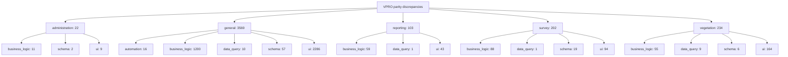

# VPRO parity discrepancy tree

```mermaid
flowchart TD
  root[VPRO parity discrepancies]
  root --> d1[administration: 22]
  d1 --> d1c1[business_logic: 11]
  d1 --> d1c2[schema: 2]
  d1 --> d1c3[ui: 9]
  root --> d2[general: 3569]
  d2 --> d2c1[automation: 16]
  d2 --> d2c2[business_logic: 1200]
  d2 --> d2c3[data_query: 10]
  d2 --> d2c4[schema: 57]
  d2 --> d2c5[ui: 2286]
  root --> d3[reporting: 103]
  d3 --> d3c1[business_logic: 59]
  d3 --> d3c2[data_query: 1]
  d3 --> d3c3[ui: 43]
  root --> d4[survey: 202]
  d4 --> d4c1[business_logic: 88]
  d4 --> d4c2[data_query: 1]
  d4 --> d4c3[schema: 19]
  d4 --> d4c4[ui: 94]
  root --> d5[vegetation: 234]
  d5 --> d5c1[business_logic: 55]
  d5 --> d5c2[data_query: 9]
  d5 --> d5c3[schema: 6]
  d5 --> d5c4[ui: 164]
```
