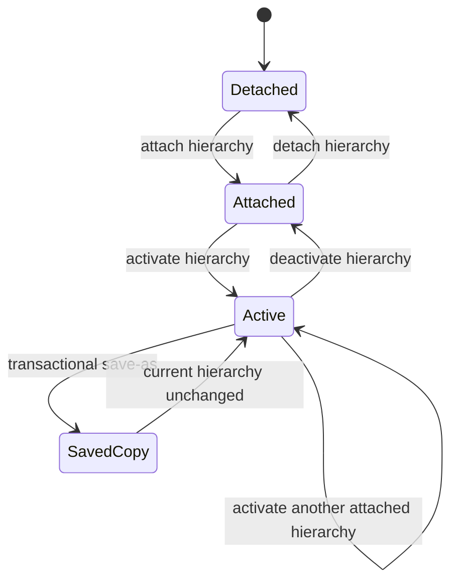

# Hierarchy lifecycle specification

## Implementation status

The package-native lifecycle is implemented in `R/hierarchy-context.R` through
`vpro_hierarchy_inspect()`, `vpro_hierarchy_attach()`,
`vpro_hierarchy_activate()`, `vpro_hierarchy_deactivate()`,
`vpro_hierarchy_detach()`, `vpro_hierarchy_save_as()`, and
`vpro_hierarchy_recover()`. A project context tracks attached and active
hierarchies and shares SQLite attachments by normalized path with projects and
site-unit tables.

Integration coverage is in `tests/testthat/test-hierarchy-context.R`, including
the bundled `Sample_Hierarchy` table.

## Scope and evidence

This specification defines the package-native lifecycle for VPRO hierarchy
tables. Primary Access SaveAsText evidence is:

- `V7mdlAttachHierarchy.AttachHierarchyTables` and `AttachHierarchyTables2`;
- `frmMainMenuFloat.cmbCurrHierarchy_AfterUpdate` and
  `cmbCurrHierarchy_GotFocus`;
- `clsVProReg.CurrHierarchy`;
- `V7mdlCreateTables.CreateHierarchyTable`;
- `V7mdlUnattach.ListUnattachHierarchyTables` and
  `UnattachSelectedHierarcies`;
- the hierarchy branch of `V7mdlSaveAs.SaveAs`, including
  `ImportHierarchyTable`, `ExportHierarchyTable`, and `Check4Table`;
- hierarchy consumers such as `mdl01Will.BuildLevelUnits` and
  `V7mdlHierarchyTools`.

## Domain model

A hierarchy is an independent table named `<name>_Hierarchy`. The fields used
by the Access hierarchy tools are:

| Column | Meaning |
|---|---|
| `ID` | Stable node identifier |
| `Name` | Node label |
| `Parent` | Parent node identifier; null for a root |
| `Level` | Stored hierarchy level |

The canonical VP04 table also contains `Tag`, `MyOrder`, `ChildID`,
`StartChild`, `LastChild`, and `Flag`. Its `Name` field is uniquely indexed and
`Parent` is indexed. Access exported no formal self-referential relationship.
The bundled `Sample_Hierarchy` contains 43 rows.

Hierarchy names are independent of project and SU names. A hierarchy may share
a database with either resource or live in a separate database.

## Observed Access behavior

### Attachment and selection

`AttachHierarchyTables` scans a selected database for names containing
`_Hierarchy`, prompts for candidates, and links selected tables. Attachment does
not select a hierarchy.

The main-menu selection event directly assigns `clsVProReg.CurrHierarchy`.
Hierarchy consumers then construct `<CurrHierarchy>_Hierarchy` dynamically.
There is no observed `SetCurrentHierarchy` procedure and no persistent generic
`Hierarchy` QueryDef.

### Detachment

The unattach UI lists exact `_Hierarchy` suffixes and excludes the current
hierarchy. The underlying deletion procedure has no independent current guard.
Deleting a linked Access TableDef removes the local link rather than the remote
table.

### Save-as

The hierarchy save-as branch imports or copies the current table to a temporary
local table and exports it as `<new_name>_Hierarchy`. It reserves `Sample`, does
not attach or select the copy, and leaves current hierarchy state unchanged.

`Check4Table` has an empty hierarchy branch and checks `<new_name>` rather than
`<new_name>_Hierarchy`. This apparent collision-check defect is not reproduced:
the package checks the actual target table before mutation.

### Startup

Access persists `CurrHierarchy`, while linked-table source paths remain in the
front-end database. `V7mdlSplash` has no explicit hierarchy recovery branch.
An in-memory DuckDB coordinator has no persistent links, so package recovery
must store and use both the hierarchy name and source path.

## Package-native lifecycle

| Operation | Required behavior |
|---|---|
| Inspect | Require exact `<name>_Hierarchy`; validate integer-compatible `ID`, `Parent`, and `Level` plus text-compatible `Name`; report metadata, indexes, row count, roots, blank names, orphan parents, and cycles without mutation. |
| Attach | Attach or reuse the containing SQLite database and register the hierarchy. Do not select it. |
| Activate | Select an attached hierarchy, expose a coordinator-scoped `Hierarchy` compatibility view, and persist its name and normalized path. |
| Deactivate | Drop the compatibility view, clear active and persisted hierarchy state, and retain the attachment. |
| Detach | Refuse the active hierarchy; otherwise remove only lifecycle registration and attachment ownership. Never modify the SQLite source. |
| Save as | Transactionally copy the table, rows, explicit indexes, and `_table_metadata` record. Reject the actual target collision and `Sample`. Do not attach or activate the copy. |
| Recover | Restore only when both persisted name and path are available. Failure clears hierarchy state without changing recovered project or SU state. The default Sample hierarchy resolves to the supplied Sample database during project recovery. |

Metadata version is reported but is not a hard attachment gate because the
observed Access attachment path does not version-check hierarchies.

## Configuration

The package persists:

- `Current.CurrHierarchy`;
- `Current.HierarchyPath`.

This is an intentional architectural difference required by ephemeral DuckDB
contexts.

## State transitions

## Intentional differences from Access

The package does not reproduce substring discovery, the defective hierarchy
save-as collision check, reliance on persistent Access links, or direct
procedure calls that can delete the current link. Validation precedes
activation, malformed tree rows are reported rather than changed, and shared
SQLite attachment ownership prevents one lifecycle resource from detaching a
database still used by another.
