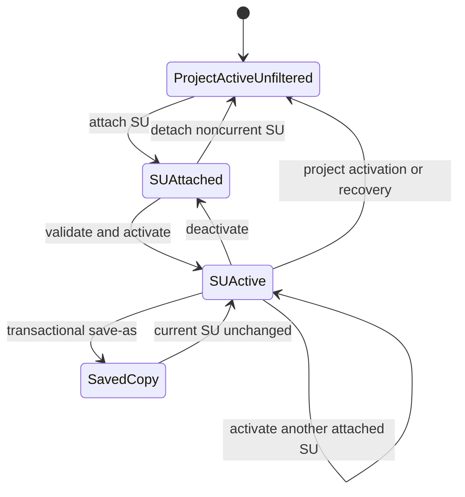

# Site-unit lifecycle specification

## Implementation status

The package-native lifecycle is implemented in `R/su-context.R` through
`vpro_su_inspect()`, `vpro_su_attach()`, `vpro_su_activate()`,
`vpro_su_deactivate()`, `vpro_su_detach()`, `vpro_su_save_as()`, and
`vpro_su_recover()`. Project contexts maintain path-level shared attachment
ownership, project activation clears SU state, and project recovery attempts
optional SU recovery without sacrificing an already recovered project.

Integration coverage is in `tests/testthat/test-su-context.R`, including the
bundled `Sample_SU` table. Master-copy authorization and hierarchy lifecycle
remain separate unresolved policy areas.

## Scope and evidence

This specification defines the package-native lifecycle for VPRO site-unit (SU)
tables. It is based on the canonical Access SaveAsText export and targeted DAO
probes run on 2026-09-22 against disposable copies of
`C:\Users\BrunoTremblay\Work\VPRO_ACCESS\VPro64\VPro64.accdb`. No production
Access database was modified.

Primary Access sources are:

- `V7mdlAttachSU.AttachSUTables`
- `V7mdlShortCutToolBarCmds.SetCurrentSu`
- `V7mdlSetCurrent.SetCurrentProject`
- `V7mdlCreateTables.CreateSuTable`
- `V7mdlUnattach.UnattachSUs`
- the SU branch of `V7mdlSaveAs.SaveAs`
- `frmMainMenuFloat.cmbCurrSU_Change`
- `V7mdlSplash.CompareRegToCurrent`

## Domain model

An SU is a named two-column table `<name>_SU`:

| Column | Meaning | Access constraint |
|---|---|---|
| `PlotNumber` | Plot included in the subset | Unique index; nullable |
| `SiteUnit` | Optional classification assigned to the plot | Non-unique index; nullable |

The canonical Sample table has metadata version `VP04`. SU names are independent
of project names and an SU may reside in the same database as a project or in a
separate database.

The exported Access relations from `Sample_SU.PlotNumber` to
`Sample_Env.PlotNumber` and from `Sample_Hierarchy.Name` to
`Sample_SU.SiteUnit` are not referential-integrity constraints. Therefore an SU
may contain blank plot rows, plots absent from the active project, null site
units, and site-unit values absent from the active hierarchy.

## Observed Access behavior

### Discovery and attachment

`AttachSUTables` scans a selected Access database for names containing `_SU`,
shows unattached candidates, and links selected tables into the front end. It
does not activate an attached SU. Non-authorized users cannot directly attach a
name containing `master`; they may create a working copy instead.

A disposable DAO probe confirmed that an attached SU is a link to the remote
table. Deleting the local TableDef removed only the link: the remote table and
all 51 Sample rows remained unchanged.

### Activation

`SetCurrentSu(name)`:

1. Deletes `Filtered_Env` and `USysEnv` QueryDefs.
2. Creates `Filtered_Env` as an inner join of the active project Env, the named
   SU, and active project Admin tables.
3. Creates `USysEnv` as a projection of `Filtered_Env`.
4. Persists `CurrPlotlist = name`.
5. Checks for blank plot rows and project-orphan rows, prompting separately to
   delete each category from the source SU table.

The Sample DAO replay produced 51 `Filtered_Env` and 51 `USysEnv` rows from 51
SU rows and 52 project Env rows. No Sample SU row was blank or orphaned.

The Access operation is not atomic. A missing SU can leave invalid persisted
`Filtered_Env` and `USysEnv` QueryDefs because definitions are created before
the source is successfully opened. Registry state is assigned only after query
creation.

Selecting `None` in the main form calls current-project activation rather than a
separate SU routine. Project activation restores unfiltered project views and
sets `CurrPlotlist = "None"`.

### Detachment

The unattach UI excludes the current SU from its candidate list. The underlying
`UnattachSUs(name)` procedure has no independent current-SU guard and suppresses
table-deletion errors. Detachment removes the linked table only and does not
modify the remote SU.

### Save-as

The SU branch of `SaveAs` requires a current SU, imports or copies it through a
local staging table, and exports it as `<new_name>_SU`. It rejects a target-table
collision and reserves `Sample` through the shared naming prompt. It does not
attach or activate the copy and does not change `CurrPlotlist`.

A disposable DAO export preserved the Sample SU's 51 rows, `PlotNumber` and
`SiteUnit` fields, unique `PlotNumber` index, non-unique `SiteUnit` index, and
`VP04` table description.

### Startup

Project activation always clears the current SU. `CompareRegToCurrent` computes
an SU mismatch but its recovery condition tests only project mismatch; it does
not repair SU state. Access can rely on linked tables persisted in its front-end
file, whereas an in-memory DuckDB coordinator cannot.

## Package-native lifecycle

The future public API should provide these operations independently of Shiny:

| Operation | Required behavior |
|---|---|
| Inspect | Validate exact table name `<name>_SU`, required fields, field compatibility, indexes where available, and translated version metadata. Return diagnostics without mutation. |
| Attach | Attach or reuse the containing SQLite database and register the SU by normalized path, table, and coordinator alias. Do not activate it. |
| Activate | Require an active project and an attached valid SU. Validate before changing views or configuration. Atomically replace `USysEnv` with an SU-filtered temporary view and retain direct access to the unfiltered project relation. Persist SU name and normalized path only after success. |
| Deactivate | Restore the active project's unfiltered `USysEnv`; set `CurrPlotlist` to `None`; clear the persisted SU path. Keep the SU attached. |
| Detach | Refuse to detach the active SU. Remove only its coordinator registration/attachment and never modify the SQLite source. Return `FALSE` if absent. |
| Save as | Transactionally copy one SU table, rows, indexes, and `_table_metadata` record to `<new_name>_SU`. Reject all target collisions and `Sample`. Do not attach or activate the result. |
| Recover | After project recovery, optionally restore an SU only when both its persisted name and path are present and valid. SU recovery failure must leave the recovered project active and unfiltered, with current SU reset to `None`. |

### Context and attachment ownership

An SU may share a SQLite file with an attached project, as Sample does. The
coordinator must reuse an existing database attachment for the same normalized
path or maintain reference-counted attachment ownership. Detaching an SU must
not detach a database still used by an active or attached project.

### Configuration

Access persisted only `CurrPlotlist` because linked-table paths lived in the
front-end database. The package must persist both:

- `Current.CurrPlotlist`
- `Current.SUPath`

Project activation and SU deactivation set `CurrPlotlist` to `None` and clear
`SUPath`. Successful SU activation writes both values. This is an intentional
architectural difference required by ephemeral DuckDB contexts.

### Validation and diagnostics

Activation must compute, return, and make available to callers:

- total SU rows;
- distinct nonblank plot numbers;
- blank plot rows;
- plot numbers absent from the active project;
- active-project plots selected after the Env/SU/Admin join; and
- duplicate plot numbers if a noncanonical table lacks the expected unique
  index.

Blank and orphan rows do not make attachment invalid because Access permits
them. They must not be deleted automatically. Activation uses the valid
intersection and returns diagnostics; cleanup is a separate explicit,
transactional domain operation requiring caller authorization.

Hierarchy membership is also diagnostic rather than an activation constraint.
Activating an SU must not implicitly activate, attach, or modify a hierarchy.

### Naming and discovery

Package discovery must use the exact `_SU` suffix, not Access's substring test.
Names use the same validated package prefix rules as projects unless a later
compatibility requirement demonstrates a need for a broader legacy-name import
path. `Sample` remains reserved for creation and save-as targets.

## State transitions

## Intentional differences from Access

The package should not reproduce these Access behaviors:

- substring-based `_SU` discovery;
- modal, activation-time deletion of blank or orphan SU rows;
- non-atomic deletion and recreation of shared QueryDefs;
- allowing the current SU to be detached through a direct procedure call;
- relying on persistent linked-table metadata instead of an explicit SU path;
- silently suppressing detach failures; or
- mutating remote master tables when creating an ordinary working copy.

These differences preserve the observed data model while making lifecycle
operations explicit, testable, non-interactive, and safe for package and Shiny
callers.
